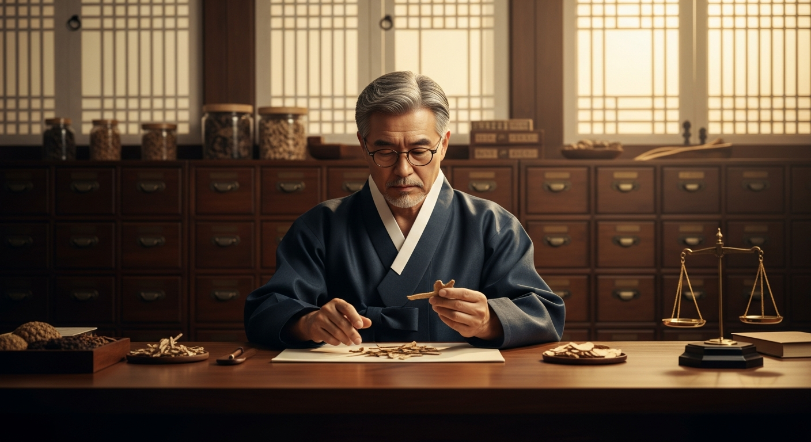

# 수인당 한의원 웹사이트 - 이미지 교체 가이드

## 폴더 구조

```
medicin/
├── index.html          # 메인 HTML 파일
├── styles.css          # 스타일시트
├── script.js           # JavaScript
├── images/             # 이미지 폴더 (생성 필요)
│   ├── hero/           # 히어로 섹션 이미지
│   ├── doctors/        # 의료진 사진
│   ├── facility/       # 시설 사진
│   ├── treatment/      # 진료 관련 이미지
│   ├── health/         # 건강 정보 이미지
│   └── etc/            # 기타 이미지
└── 이미지_교체_가이드.md
```

---

## 이미지 교체 방법

### 1. 기본 방법 (HTML 직접 수정)

placeholder를 찾아서 `` 태그로 교체합니다.

**변경 전:**
```html
<div class="image-placeholder">
  <div class="placeholder-content">
    <span class="placeholder-icon">🏥</span>
    <p>히어로 이미지 영역</p>
    <small>권장 크기: 1920 x 800px</small>
  </div>
</div>
```

**변경 후:**
```html

```

---

## 이미지 목록 및 권장 크기

### 히어로 섹션
| 위치 | 파일명 예시 | 권장 크기 | 설명 |
|------|-------------|-----------|------|
| 메인 히어로 | `hero/main.jpg` | 1920 x 800px | 한의원 외관 또는 대표 이미지 |
| CTA 배경 | `hero/cta-bg.jpg` | 1920 x 600px | 분위기 있는 한의원 이미지 |

### 인사말 섹션
| 위치 | 파일명 예시 | 권장 크기 | 설명 |
|------|-------------|-----------|------|
| 원장 인사 | `doctors/greeting.jpg` | 600 x 700px | 원장님 인사 사진 |

### 의료진 소개
| 위치 | 파일명 예시 | 권장 크기 | 설명 |
|------|-------------|-----------|------|
| 대표원장 | `doctors/doctor1.jpg` | 400 x 500px | 원장 프로필 사진 |
| 부원장 | `doctors/doctor2.jpg` | 400 x 500px | 부원장 프로필 사진 |

### 시설 안내
| 위치 | 파일명 예시 | 권장 크기 | 설명 |
|------|-------------|-----------|------|
| 대기실 (대형) | `facility/lobby.jpg` | 800 x 600px | 넓은 대기실 |
| 진료실 | `facility/clinic.jpg` | 500 x 400px | 진료실 내부 |
| 침치료실 | `facility/acupuncture.jpg` | 500 x 400px | 침치료실 |
| 물리치료실 | `facility/therapy.jpg` | 500 x 400px | 물리치료실 |
| 탕전실 | `facility/pharmacy.jpg` | 500 x 400px | 탕전실 |

### 진료 과목
| 위치 | 파일명 예시 | 권장 크기 | 설명 |
|------|-------------|-----------|------|
| 한방 내과 | `treatment/internal.jpg` | 400 x 300px | 내과 관련 이미지 |
| 통증 클리닉 | `treatment/pain.jpg` | 400 x 300px | 통증 치료 이미지 |
| 여성 건강 | `treatment/women.jpg` | 400 x 300px | 여성 건강 이미지 |
| 보양 체력 | `treatment/vitality.jpg` | 400 x 300px | 보양 관련 이미지 |

### 치료 방법
| 위치 | 파일명 예시 | 권장 크기 | 설명 |
|------|-------------|-----------|------|
| 침 치료 | `treatment/method-acupuncture.jpg` | 350 x 250px | 침 치료 장면 |
| 뜸 치료 | `treatment/method-moxa.jpg` | 350 x 250px | 뜸 치료 장면 |
| 부항 치료 | `treatment/method-cupping.jpg` | 350 x 250px | 부항 치료 장면 |
| 한약 처방 | `treatment/method-herb.jpg` | 350 x 250px | 한약 이미지 |
| 추나 요법 | `treatment/method-chuna.jpg` | 350 x 250px | 추나 요법 장면 |
| 약침 치료 | `treatment/method-pharmacopuncture.jpg` | 350 x 250px | 약침 치료 장면 |

### 진료 시간 섹션
| 위치 | 파일명 예시 | 권장 크기 | 설명 |
|------|-------------|-----------|------|
| 진료 환경 | `facility/consultation.jpg` | 600 x 500px | 상담 장면 |

### 건강 정보
| 위치 | 파일명 예시 | 권장 크기 | 설명 |
|------|-------------|-----------|------|
| 계절 건강 | `health/seasonal.jpg` | 500 x 350px | 계절 관련 이미지 |
| 음식 건강 | `health/food.jpg` | 500 x 350px | 건강 음식 이미지 |
| 생활 건강 | `health/lifestyle.jpg` | 500 x 350px | 건강 생활 이미지 |

### 오시는 길
| 위치 | 파일명 예시 | 권장 크기 | 설명 |
|------|-------------|-----------|------|
| 지도 | - | 800 x 500px | 카카오맵/네이버맵 연동 또는 이미지 |

---

## 이미지 최적화 권장사항

1. **파일 형식**
   - 사진: JPG (품질 80-90%)
   - 투명 배경 필요시: PNG
   - 간단한 그래픽: SVG

2. **파일 크기**
   - 히어로/대형 이미지: 300KB 이하
   - 중형 이미지: 150KB 이하
   - 소형 이미지: 80KB 이하

3. **해상도**
   - 레티나 대응: 권장 크기의 2배로 준비 후 CSS로 크기 조절

4. **최적화 도구**
   - [TinyPNG](https://tinypng.com/)
   - [Squoosh](https://squoosh.app/)

---

## 지도 연동 방법

### 카카오맵 API 사용시

`index.html`의 지도 영역을 다음으로 교체:

```html
<div id="map" style="width:100%;height:450px;"></div>

<script type="text/javascript" src="//dapi.kakao.com/v2/maps/sdk.js?appkey=YOUR_APP_KEY"></script>
<script>
  var container = document.getElementById('map');
  var options = {
    center: new kakao.maps.LatLng(37.5665, 126.9780), // 한의원 좌표
    level: 3
  };
  var map = new kakao.maps.Map(container, options);

  // 마커 추가
  var marker = new kakao.maps.Marker({
    position: new kakao.maps.LatLng(37.5665, 126.9780)
  });
  marker.setMap(map);
</script>
```

---

## 수정해야 할 정보

1. **전화번호**: `02-1234-5678` → 실제 전화번호
2. **주소**: `서울특별시 OO구 OO로 123` → 실제 주소
3. **이메일**: `info@suindang.com` → 실제 이메일
4. **의료진 정보**: 실제 원장/부원장 정보로 수정
5. **진료 시간**: 실제 운영 시간으로 수정

---

## 문의

이미지 교체 또는 수정 관련 문의사항이 있으시면 연락 주세요.
